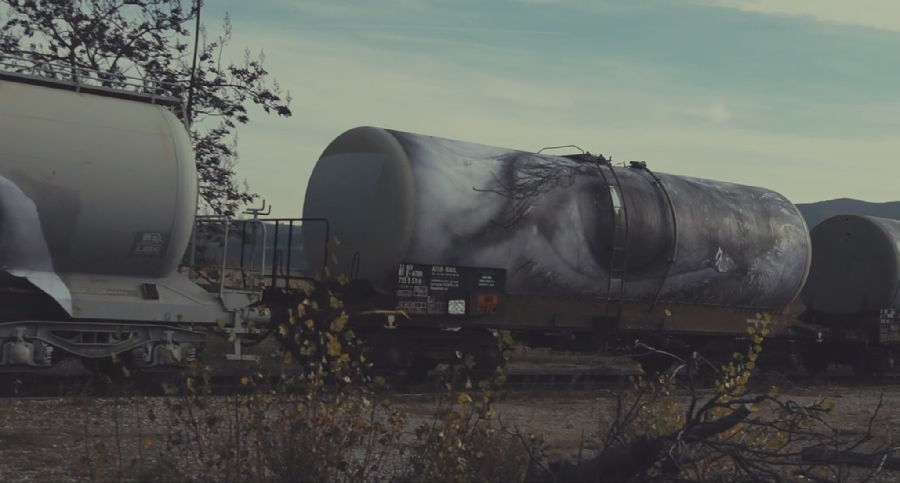

# Major Project - The Pulse of the City

## Instructions
Please put on your headphones.
1. Move the mouse slowly across the screen and click the play button.
2. Slowly move the mouse upwards to increase the volume until it's audible.
3. Slowly move the mouse left and right to switch channels, and move the mouse up and down to control the volume.
4. Press pause if you need to stop the music.

## Detailed Animation Approach
- ### Methodology
I chose **audio** to drive my individual code, and **the size of blocks** and **positions of each building** in the image will be animated. The size of the blocks will fluctuate according to **the level**, and the positions of the buildings will shift left and right with **panning**. I also added **eyes** that close in response to both mouse movement and volume control, as well as **a music level curve** drawn in the background to simulate a **heartbeat**. 

***Note**: **The relative changes in position and the size of the color blocks, controlled primarily by mouse-driven volume control, are particularly unique compared to how other students interact with the blocks through user input by clicking.***

- ### Inspirations
In my work, I drew inspiration from **Paul Klee’s *Senecio***, a portrait of an elder that, much like Mondrian’s work, skillfully utilizes color blocks and lines. **The eyes** in *Senecio* are particularly striking, evoking a sense of innocence and curiosity, while also conveying a certain mystery and unease. 

Additionally, I was inspired by the documentary ***Visages villages***, where the artists paste large portraits onto walls, giving ordinary people a sense of visibility and importance. 

Similarly, I have **added eyes** to the architecture in my project. This design aims to **break away from traditional representations of buildings, imbuing them with a sense of life, as if each structure is a larger entity within the city, symbolizing the mutual gaze between people and the urban landscape**. Klee explored complex human emotions through geometric shapes and colors, and I hope that this treatment allows viewers to feel the hidden stories and unique perspectives behind the architecture.

1. *Senecio*

[Klee, P. (1922). Senecio [Oil on canvas mounted on panel]. Kunstmuseum Basel, Basel.](https://en.wikipedia.org/wiki/Senecio_(Klee))

2. Screenshots of *Visages villages*

Varda, A., & JR. (Directors). (2017). Visages villages [Documentary]. Ciné Tamaris.

In my sound design, I draw directly from **Max Neuhaus’s iconic *Times Square***, a sound installation that has long been an integral, yet subtle, part of the Times Square environment. Neuhaus’s piece, hidden beneath a pedestrian island grate, emits a low, resonant hum that blends with the city’s natural soundscape. Often mistaken for ambient subway noise, this sound is carefully crafted to evoke a “rich, harmonic sound texture resembling the after-ring of large bells,” creating an almost meditative auditory experience amid the bustling urban scene. Just as Mondrian’s composition reflects the grid-like energy and flow of Broadway, I try to bring the city’s pulse to life audibly, **merging visual and sonic interpretations of New York’s dynamic heartbeat**.

[Julian, S. (2016, April 29). *1590 Broadway, New York, NY 10036, USA - Max Neuhaus Times Square Sound Installation.* Radio Aporee.](https://archive.org/details/aporee_49142_55998)

[Performance Today. (February 12, 2020). *New York Out Loud: Max Neuhaus’ “Times Square”.* [Video]. YouTube.](https://www.youtube.com/watch?v=kA-fihBFWBI) 

## Modifications

- ### Iteration 1
I added sound and used a button to control its playback. I also adjusted the **button’s style** to match the overall aesthetic of the scene. The volume and panning change with the movement of the **mouse** by the **mouseMoved function**, and I modified **the amount of translation** for each building so that the four buildings in the scene move in sync **with the panning** as they shift left and right.

- ### Iteration 2

I added an effect where the size of the building blocks changes based on the **root mean square (RMS) level** by modifying the code in the **drawRect function**. As the mouse moves upward, the volume increases, and the buildings gradually emerge. This abstract effect enhances the linear quality, just like in the original artwork, while the lack of specific building shapes adds a sense of unease for the viewer.

- ### Iteration 3

I first created an array based on the level to **draw curves** in the background that change according to the **ampArray**. These curves track the changes in audio levels **controlled by the mouse** and visually resemble an **electrocardiogram, simulating the heartbeat of a city**. Since both the background and the abstract buildings in iteration 2 were irregular, I adjusted the color block variations in iteration 2, making them **change only in the vertical direction with the RMS values**, while preserving the basic shape of the buildings. I also created an **“eye” class** to add an eye to each building. The eye **colors** match the color blocks of the buildings themselves, and the eyes vibrate vertically with the level and buildings, creating an uneasy effect. Additionally, the eyes can be **controlled by moving the mouse up and down to adjust the degree of openness**.

- ### Iteration 4
I **refined some elements**, such as removing the stroke from the eyes and increasing the stroke weight of the heartbeat curve to better match the style of the buildings. I also reattempted the method from iteration 2, where all building blocks change with the music, and based on feedback from my group members, I decided to keep it. This method enhances **interactivity** with the appearance and disappearance of blocks, creating a stronger rhythm in sync with the heartbeat curve. Additionally, when the buildings **overlap, the eyes on the back buildings become more visible**. This way, the mouse not only controls the eyes’ closure but also **controls the presence of buildings**, and by overlapping them during music playback, **new building forms are created**.

*Tips: I have kept the less unsettling interaction method from iteration 3 in the code comments.*

***Acknowledgement:** Assisted with ChatGPT in building the eye class and language translation.*